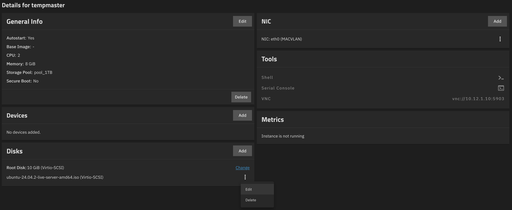

# Create a master node in a Kubernetes cluster

## Goal
- To run a small Kubernetes cluster with just one master node and a handful or worker nodes, and do it all on virtual machines.
- Automate parts of the process of setting up a brand new virtual machine.

There are lots of installations and configurations to be done.
It would be nice to have a machine image that can be replicated, but as yet I haven't found a way to do that. That is left for future.

Overall the steps we are following are those documented in
- https://kubernetes.io/docs/setup/production-environment/tools/kubeadm/install-kubeadm/
- https://kubernetes.io/docs/setup/production-environment/container-runtimes/
- https://github.com/containerd/containerd/blob/main/docs/getting-started.md
- https://github.com/containerd/containerd/releases

### Environment
Truenas Fangtooth on a home server with 2 old Xeon processors and lots or RAM.

Create an instance (VM) with Ubuntu Server 24.04 LTS as the starting point. [https://releases.ubuntu.com/noble/ubuntu-24.04.2-desktop-amd64.iso]

> [!NOTE]
> A ZVol is not necessary to install the OS.

Download the Ubuntu Server 24.04 LTS Live Server ISO image from the internet and upload it to Truenas as a Volume. When creating a new instance, choose this uploaded volume.
 
### Create the VM (i.e. instance)
- 2 CPU
- 8 GiB RAM
- 10 GiB Root Disk
- Select the appropriate NIC
- Setup a VNC port of 5901 (so that it does not clash with 5900 already in use)

Once the VM has started, use a VNC viewer (Screen Sharing app on iMac) to login to the machine at vnc://10.12.1.10:5901

### Installation
From the VNC window:
- Begin the Ubuntu installation process
  - Choose the minimized option
  - Choose the OpenSSH option at the end and import your public ssh key from github.com
- Complete the OS installation and reboot
- After reboot:
  - Stop the running instance from Truenas
  - Delete the Ubuntu Server 24.04 LTS **disk** _from this instance only_ 
  - Unselect Autostart
  - Start the instance and take note of which IP address it has started up at (either by logging in from VNC and running ```ip a``` or from your router)
  - SSH into the machine using that IP address

### Checks
On logging in to the machine, verify a few things:

1. swap space is off
```
nikhil@k8smaster:~$ free -m
               total        used        free      shared  buff/cache   available
Mem:            7929         513        6905           4         826        7416
Swap:              0           0           0
```

2. ipv4 forwarding is off (it will be turned on by our script)
```
nikhil@k8smaster:~$ sysctl net.ipv4.ip_forward
net.ipv4.ip_forward = 0
```

3. The cgroup driver used on the system is `cgroup2fs`
```
nikhil@k8smaster:~$ stat -fc %T /sys/fs/cgroup/
cgroup2fs
```

### Upgrade
On the fresh system, run the below two commands and then reboot. These can be run from VNC or SSH.
```
sudo apt update && sudo apt upgrade -y
sudo reboot now
```

### Assinging a static IP
```ip a``` will also show you the MAC address, which you can then use to setup a DHCP reservation in the router to assign a static IP address e.g. 10.12.1.12 to this MAC address. Restart both the router and the VM to take effect. Verify by running ```ip a``` again.

### Next Step
To run the ```master_step_1.sh``` file after SSH'ing in:
```
wget https://raw.githubusercontent.com/nikhilpatwardhan/Kubernetes_Cluster_24_04/refs/heads/main/master_step_1.sh
chmod +x master_step_1.sh
sudo ./master_step_1.sh
```